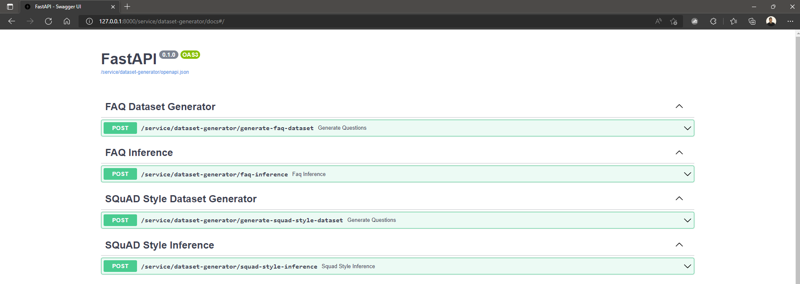
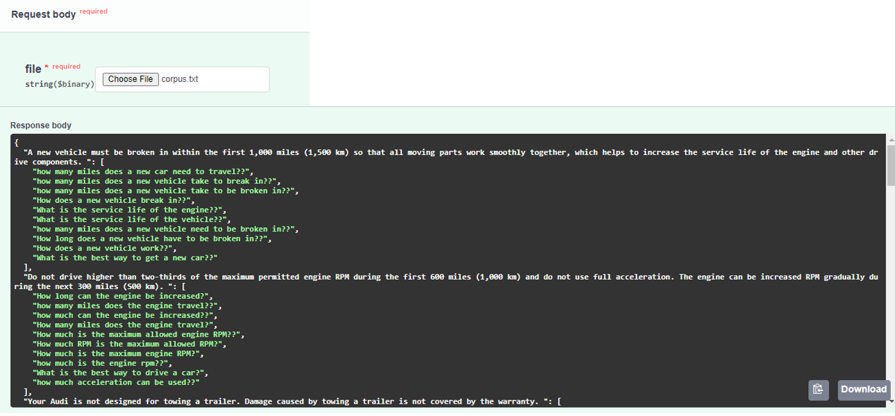
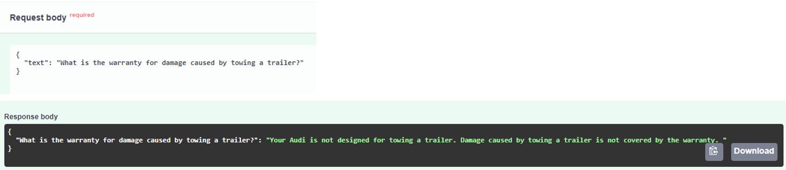
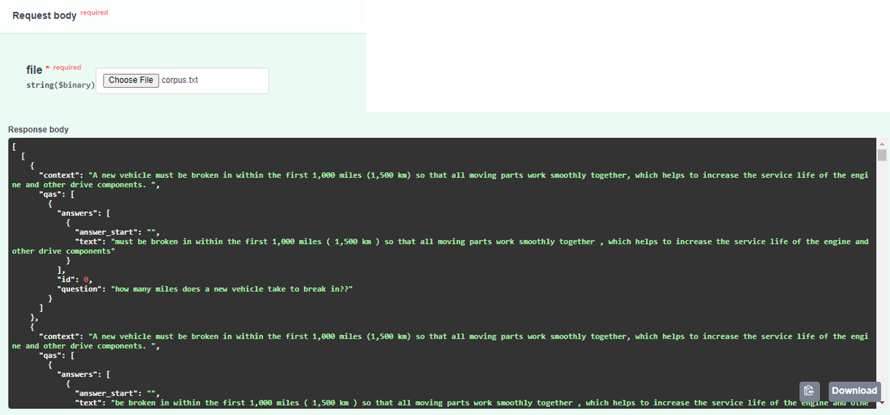
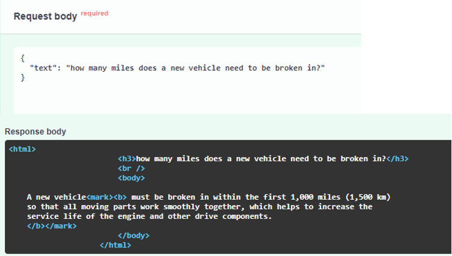
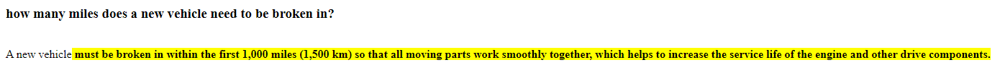

## Ideation
* **Personalized Voice Sampling for Cockpit Interaction**: Change the voice of the cockpit speech assistant by sampling a user preferred voice.
* **Single Handed Sign Language Recognition for Inclusitivity focussed Cockpit Interaction**: Enable speech impaired individuals to be able to interact with the cockpit voice assistant via sign language. 
* **Automated Generation of FAQ and QA Datasets from existing Car Manuals**: Training Digital Assistants/Chatbots with automatically generated FAQ Datasets and Extractive Document Search using QA datasets. The cockpit assistant can *learn* all the information present in a user manual and can answer any relevant question  posed to it by the user.

## Feasibility Study
The ideas  - **Personalized Voice Sampling for Cockpit Interaction** and **Single Handed Sign Language Recognition for Inclusitivity focussed Cockpit Interaction** - even though were futuristic and cool, considering the time constraint and in direct relation to the required topic of the automotive domain, were not considered and I proceeded to implement **Automated Generation of FAQ and QA Datasets from existing Car Manuals**, since I have professionally worked on the topics of automatically parsing passages to exhaustively generate questions which might be asked by an user and created extractive, abstractive and summarized  document search system pipelines with training and inference combined.  
## Background

A **Noun Phrase (NP)**, or nominal (phrase), is a phrase that has a noun or pronoun as its head or performs the same grammatical function as a noun as a part of a sentence. A string of words that can be replaced by a single pronoun without rendering the sentence grammatically unacceptable is a noun phrase. A typical noun phrase consists of a noun (the head of the phrase) together with zero or more dependents of various types like determiners, (such as the, this, my, some, Jane's), attributive adjectives (such as large, beautiful, sweeter) etc. In order to identity if a phrase is a noun phrase, we must  check if it can be possible to replace it with a pronoun. For example,
'Summer days are long' -
'They are long'.
Here we can replace "Summer days" with a pronoun "They" without altering  the meaning of the sentence. Hence it is the noun phrase.

In linguistics, a **Verb Phrase (VP)** is a unit composed of a verb and its arguments except the subject of the sentence. Verb phrases express an idea but cannot stand alone as a sentence. They can also include modifiers, complements, and direct or indirect objects as complete verb phrases.
A Verb phrase can include a helping verb and main verb in a sentence. Main verbs establish the action of the sentence. They can function on their own or with a helping verb in a verb phrase.

For example:
The doctor has *taken* an oath to protect her patients.
Here taken is the main verb and protect is the helping verb. main verbs provide more details about what the subject is doing. They work with the helping verbs in their verb phrases to create a full picture of the sentence’s action.

Some more examples of verb phrases: The shoes *don’t fit* his feet.
I *should ask* the director his opinion.
We *aren’t allowed* to go in there.

**Gist**: *Noun phrase (NP)* are phrases where a noun acts as the head word. *Verb phrase (VP)* phrases are lexical units that have a verb acting as the head word. Identifying Noun Phrases and Verb Phases in the sentences of a context allows us to come up with questions with these phrases as their answers. These phrases can answer commonly asked 'Who','What','When', 'Where','Why','How' etc., type of questions. Reverse engineering! 

Based on this extracted information, I provide solutions to two use cases - **FAQ** and **QA** - in this implementation.

## Architecture
Each use case provided two stages: Dataset Generation and Inference.
To address scalability, a microservice based architecture is chosen where each function is a service as a separate REST API end point on its own and hence can be scaled easily. These services can be chained to form pipelines containing a data generation phase and an inference phase. Each service can also be containerized for cloud deployment via Docker, further addressing scalability. 
## Implementation

An initial step involves obtaining a User Manual for an Audi Car and parsing it via Optical Character Recognition (OCR) to fetch raw text data. I chose the Audi TT Owners' manual because I like that car :D. The OCR stage can be avoided if the information inside the manual is available as a document store.

FAQ - Steps involved:
* For a given paragraph, determine Noun Phrases and Verb Phrases for each constituent sentence. 
* Pass these collected Noun and Verb Phrases as **answers** along with each paragraph to a pre-trained T5 based Question Generation model. 
* The model then outputs all possible **questions** relevant to the input passage
* These questions are then passed to a pre-trained BERT based Question Answer Evaluation model to determine how relevant are the generated questions to their answers.
* The relevance is scored and the Question-Answer pairs can be filtered based on the relevance score.
* Inference can be performed by Cosine Similarity matching the user query with the dataset of questions and the answer for the highest matched question can be returned.

In the end we end up a dataset of relevance filtered set of questions for each paragraph in the document which acts as our *corpus*. This entire system is available as a REST API endpoint where we can upload our parsed user manual and we obtain the dataset as a response.

QA - Steps involved:
* For a given paragraph, determine Noun Phrases and Verb Phrases for each constituent sentence. 
* Pass these collected Noun and Verb Phrases as **answers** along with each paragraph to a pre-trained T5 based Question Generation model. 
* The model then outputs all possible **questions** relevant to the input passage
* These questions are then passed to a pre-trained BERT based Question Answer Evaluation model to determine how relevant are the generated questions to their answers.
* The relevance is scored and the Question-Answer pairs can be filtered based on the **relevance score**.
* The Answers for which the Questions were the most relevant are identified
* The **position** of these answers are traced back to their origin sentences and a SQuaD style dataset is created with attributed pertaining to context, question, answer and answer start and end indices.
* A BERT based model is fine tuned with this generated dataset for the downstream task of Extractive Question Answering.  
* Inference can be performed passing the user query to the trained model to obtain the closest matched start and end indices of answer spans within the context.

In the end we end up with a trained model capable of Question Answering, identifying the paragraph from which the answer originates, annotate the paragraph with the span of the answer. 

## Results
Screenshots of Request-Response outputs of each service endpoint are showcased here.
### RESTAPI Endpoints

### FAQ Dataset Generator Request-Response

### FAQ Inference Request-Response

### QA (SQuaD Format) Dataset Generator Request-Response

### QA (SQuaD Format) Inference Request-Response

### References

* https://www.kdnuggets.com/2018/08/understanding-language-syntax-and-structure-practitioners-guide-nlp-3.html
* https://spacy.io/usage/linguistic-features
* https://huggingface.co/transformers/v3.5.1/custom_datasets.html#qa-squad
* https://annotate.deepset.ai/index.html
* https://discuss.huggingface.co/t/predicting-answers-using-distilbertforquestionanswering/3307/3
* https://huggingface.co/docs/transformers/task_summary#extractive-question-answering 
